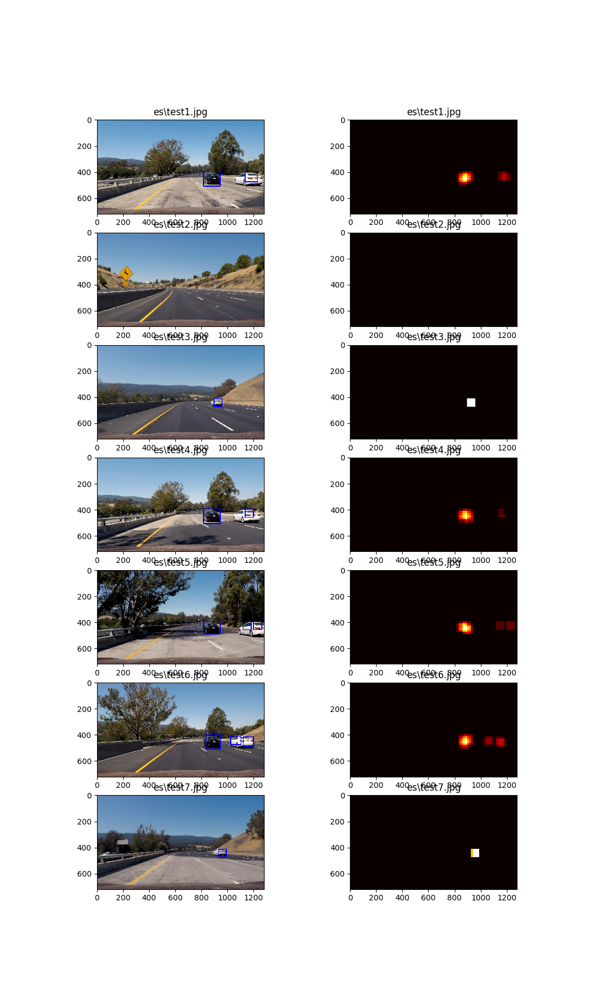
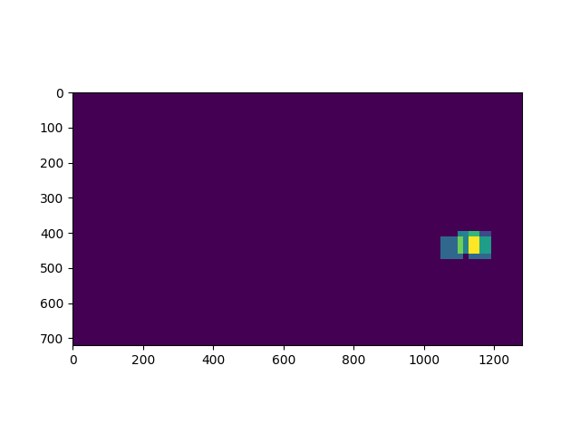
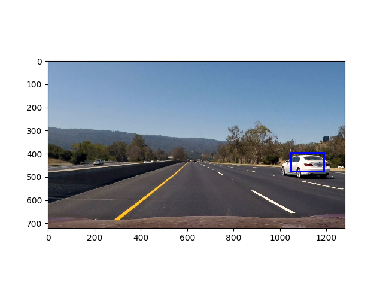

##Udacity SDCND Term 1 P5 - Vehicle Detection and Tracking

---

**Vehicle Detection Project**

The goal of this is to write a software pipeline to identify vehicles in a video from a front-facing camera on a car.

The goals / steps of this project are the following:

* Normalize features and randomize a selection for training and testing
* Perform a Histogram of Oriented Gradients (HOG) feature extraction on a labeled training set of images and train a classifier Linear SVM classifier
* Apply a color transform and append binned color features, as well as histograms of color, to your HOG feature vector. 
* Implement a sliding-window technique and use the trained classifier to search for vehicles in images.
* create a heat map of recurring detections frame by frame to reject outliers and, in the video, follow detected vehicles.
* Run the pipeline on a video stream (starting with a short video test_video.mp4 and later implement on full project_video.mp4) 
* Estimate a bounding box for vehicles detected.

[//]: # (Image References)
[image1]: ./examples/car_not_car.png
[image2]: ./examples/HOG_example.jpg
[image3]: ./examples/sliding_windows.jpg
[image4]: ./examples/sliding_window.jpg
[image5]: ./examples/bboxes_and_heat.png
[image6]: ./examples/labels_map.png
[image7]: ./examples/output_bboxes.png
[video1]: ./project_video.mp4

## [Rubric](https://review.udacity.com/#!/rubrics/513/view) Points
###Here I will consider the rubric points individually and describe how I addressed each point in my implementation.  

###Histogram of Oriented Gradients (HOG)

####1. Explain how (and identify where in your code) you extracted HOG features from the training images.

The code for this step is contained in lines #271 through #273 of the file called `taining.py`, which in turn is calling get_hog_features contained in lines 38-60 of lesson_functions.py

I started by reading in all the `vehicle` and `non-vehicle` images.  Here is an example of one of each of the `vehicle` and `non-vehicle` classes:

![alt text][image1]

The car images contained in the GTI folders were very similar, which caused overfitting, where the KITTI images were not. We took every 8th image from the GTI folders but all of the images from the KITTI folder and got better results.

I then explored different color spaces and different `skimage.hog()` parameters (`orientations`, `pixels_per_cell`, and `cells_per_block`).  I grabbed random images from each of the two classes and displayed them to get a feel for what the `skimage.hog()` output looks like.

Here is an example using the `YCrCb` color space and HOG parameters of `orientations=8`, `pixels_per_cell=(8, 8)` and `cells_per_block=(2, 2)`:

![alt text][image2]

####2. Explain how you settled on your final choice of HOG parameters.

What I discovered is that if the false positive rate was above 0.5%, the probability of tracking a non-vehicle in the video was too high. Using all of the hog parameters was necessary to achieve that result.

####3. Describe how (and identify where in your code) you trained a classifier using your selected HOG features (and color features if you used them).

I trained a linear SVM using:
- colospace of YCrCb
- orientations = 9
- pixels per cell = (8,8)
- cells per block = (2,2)
- scale = 1
- xstart, xstop = (600, 1280)
- ystart, ystop = (380, 636)
- hog channel = "ALL"
- spatial size = (32, 32)
- hist bins = 32
- use all types of features (spatial, hist, and HOG)

Results of processing:
* 52.432133436203  Seconds to compute features...
* Using  6320  samples with  9  orientations, 8  pixels per cell,  2  cells per block 32  histogram bins, and  (32, 32)  spatial samplng
* Feature vector length:  8460
* 2.86 Seconds to train SVC...
* Test accuracy of SVC =  0.9984
* false positives= 0.0 %
* false negatives= 0.1582 %

Note that the result of processing varied slightly from run to run, but was in the same range of greater than 99.5% accuracy.

###Sliding Window Search

####1. Describe how (and identify where in your code) you implemented a sliding window search.  How did you decide what scales to search and how much to overlap windows?

In order to achieve the desired result, I searched at four window sizes as shown in the process_frame method in training.py (lines 324-338). I tried limiting the region that the windows were used to a reasonable portion of the frame (i.e., the small windows to the top and the large windows to the bottom), but this did not seem to help much.

Each sliding window size was used to call the find_cars routine and return a heatmap. The heatmaps were summed, and a threshold applied to the summed windows. The result, after adjusting the threshold, was a solid image of the cars with few or no false positives.

To further eliminate false positives, I took advantage of the fact that we were in the left lane, and so the cars were always on the right side of the image.

####2. Show some examples of test images to demonstrate how your pipeline is working.  What did you do to optimize the performance of your classifier?

Ultimately I searched on two scales using YCrCb 3-channel HOG features plus spatially binned color and histograms of color in the feature vector, which provided a nice result.  Here are some example images and their associated heatmaps:

---

### Video Implementation

####1. Provide a link to your final video output.  Your pipeline should perform reasonably well on the entire project video (somewhat wobbly or unstable bounding boxes are ok as long as you are identifying the vehicles most of the time with minimal false positives.)
Here's a [link to my video result](./output_project.mp4)

####2. Describe how (and identify where in your code) you implemented some kind of filter for false positives and some method for combining overlapping bounding boxes.

I recorded the positions of positive detections in each frame of the video.  From the positive detections I created a heatmap.  I then added that heatmap to heatmaps in subsequent frames, for some defined queue length (6 seemed to work best). I then thresholded that map to identify vehicle positions. I then used `scipy.ndimage.measurements.label()` to identify individual blobs in the heatmap.  I then assumed each blob corresponded to a vehicle.  I constructed bounding boxes to cover the area of each blob detected.

Here's an example result showing the heatmap from a series of 6 frames of video, the result of `scipy.ndimage.measurements.label()` and the bounding boxes then overlaid on the last frame of video:

### Here is the sum of the integrated heatmap from all six frames:

### Here the resulting bounding boxes are drawn onto the last frame in the series:

---

###Discussion

####1. Briefly discuss any problems / issues you faced in your implementation of this project.  Where will your pipeline likely fail?  What could you do to make it more robust?

Here I'll talk about the approach I took, what techniques I used, what worked and why, where the pipeline might fail and how I might improve it if I were going to pursue this project further.

As I tried to figure out what to do and made changes to the base algorithm, I realized more and more I needed to instrument the code. That is, instead of change hard coded values, parameterize the calls so that the changes could be made at the main routine. Also, that made sure that the training and search used the same values.

The biggest issue I had that I never knew I had was with the data. Until I realized that I was over fitting by including was almost exact duplicates of car images, I had no idea what I needed to change.

Another key was finding the right metrics to measure the quality of the training. Once it was pointed out to me that the false positives (i.e. phantom cars) had to be extremely low to make sure that the random hot spots caused by them would not repeat over a large enough area so that a false positive would not be detected over several frames.

Another diagnostic I put in was to "fast forward" the video. Essentially skip ahead a certain number of frames. That way, if I saw an anomaly in the video, I could note the timestamp and skip ahead and see what the raw heatmap looked like along with the max heatmap value (which I calculated from the sum of the heatmaps). This way I could see if the problem was a false positive or too low/high a threshold setting.

What I would change?
- Sometimes I saw two label regions adjacent to each other. I would have changed the algorithm to recognize this and combine them. I would need to set some limit of how close they were, otherwise if there were two cars far apart I would get a ridiculously large bounding box.
- Spend more time to try to adjust the sliding windows to work over smaller regions. I still believe it should work, and maybe after I realized I only needed to search on the right side of the road it would have. I believe that reducing the number of windows would significantly improve the performance of the algorithm.
- save the training data so I could run the search separately. I could not pickle the X_scale data, because it is a complex set of numpy arrays. So I would have had to pickle them separately and put them back together. Because I was changing the base parameters so often at first, it wasn't worth the effort. Later, when I finally got things right, it might have sped up the analysis.

